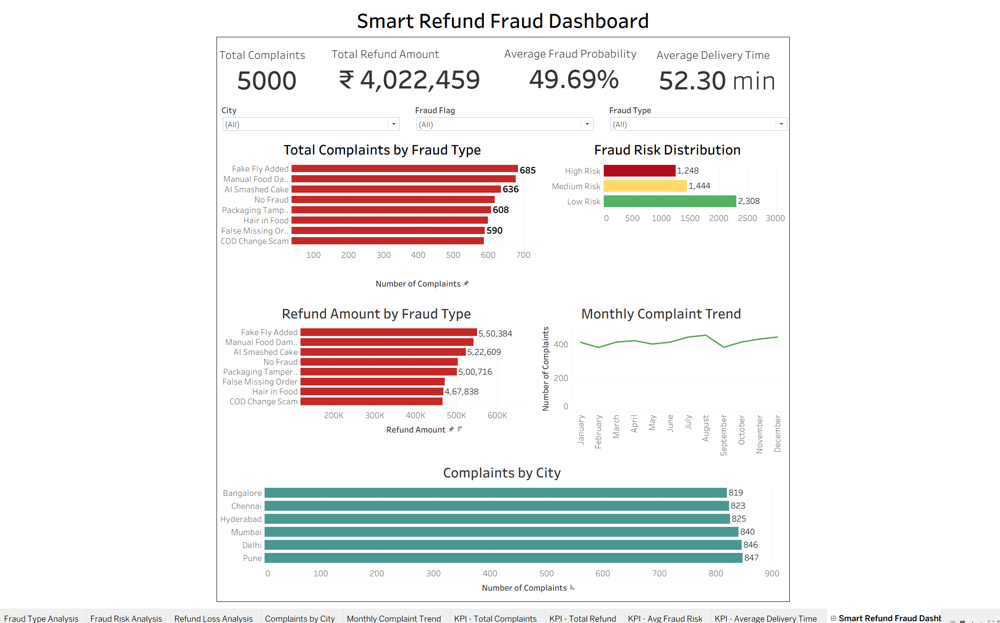

# Food Delivery Fraud Intelligence Dashboard

## 📊 Project Overview

An interactive Tableau dashboard designed to analyze refund complaints and fraud-risk patterns in a food delivery environment.

The dashboard helps identify high-risk complaint categories, understand refund losses, analyze city-level complaint patterns, and track complaint trends over time.

## 🎯 Objectives

- Analyze food delivery refund complaints
- Identify fraud-risk distribution
- Understand refund losses by fraud type
- Analyze complaint patterns across cities
- Track monthly complaint trends
- Provide interactive filtering for fraud investigation

  ## 📸 Dashboard Preview

## 📈 Dashboard Features

### Key Performance Indicators
- Total Complaints
- Total Refund Amount
- Average Fraud Probability
- Average Delivery Time

### Visualizations
- Total Complaints by Fraud Type
- Fraud Risk Distribution
- Refund Amount by Fraud Type
- Monthly Complaint Trend
- Complaints by City

### Interactive Filters
- City
- Fraud Risk
- Fraud Type

## 🛠️ Tools & Technologies

- Tableau
- Microsoft Excel
- Data Visualization
- Business Intelligence
- KPI Analysis

## 📂 Dataset

The dashboard uses a synthetic food delivery refund/complaint dataset created for academic and portfolio purposes.

The dataset does not contain real customer data from Zomato, Swiggy, or any other company.

## 💡 Key Insights

The dashboard can be used to explore:

- Which complaint categories contribute most to refund activity
- How fraud risk is distributed across complaints
- Which fraud categories are associated with higher refund losses
- Which cities have higher complaint volumes
- How complaint activity changes over time

## ⚠️ Disclaimer

This project is an independent academic/portfolio project using synthetic data. It is intended for analytical demonstration and does not represent the internal systems, data, or fraud-detection methods of any specific food delivery company.
